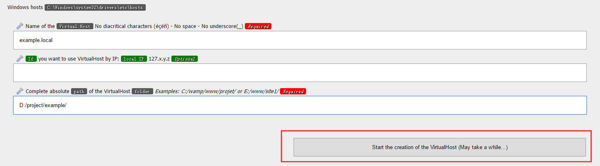
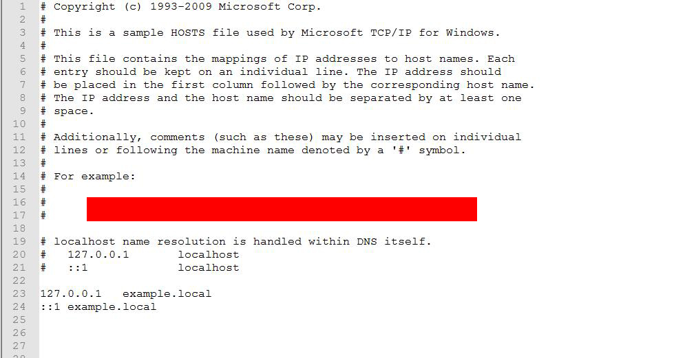

## 通过WAMP基于Windows配置虚拟主机

### USAGE

#### 在此之前

- 需要准备以下东西`Windows电脑` +` WAMP` + `Navicat(或者使用wamp自带的phpMyAdmin)`
- 如果是PHP IDE的话，可以使用`PhpStorm`或者`atom`

#### 方法/步骤

- 运行你的`WAMP`，并确保你的`WAMP`是绿色的运行状态。
- 首先检查一下你的`httpd-vhosts`配置是否打开，在`{你的wamp安装路径}\bin\apache\apache2.4.23\conf\`文件夹下，找到`httpd.conf`，使用记事本或者nodepad++打开它，搜索#Include conf/extra/httpd-vhosts.conf，把前面的#去掉，然后保存。
- 打开你的浏览器，输入 [http://localhost/](http://localhost/) ，并且点击 [Add a Virtual Host](http://localhost/add_vhost.php?lang=chinese) ，配置你自己的virtual host，如下图所示：

  

- 打开`C:\windows\System32\drivers\etc`下的`hosts`文件，确认你的virtual host添加到hosts文件里(一般情况下WAMP会自动添加)。

  

- 重启WAMP。
